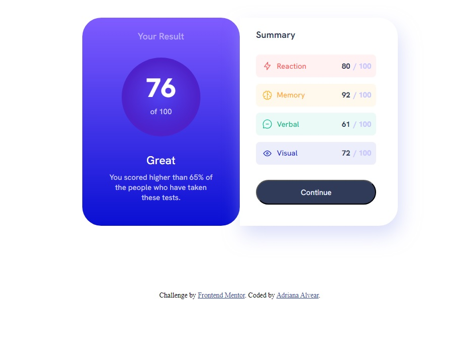

# Frontend Mentor - Results summary component solution

This is a solution to the [Results summary component challenge on Frontend Mentor](https://www.frontendmentor.io/challenges/results-summary-component-CE_K6s0maV). Frontend Mentor challenges help you improve your coding skills by building realistic projects. 

## Table of contents

- [Overview](#overview)
  - [The challenge](#the-challenge)
  - [Screenshot](#screenshot)
- [My process](#my-process)
  - [Built with](#built-with)
  - [What I learned](#what-i-learned)
  - [Continued development](#continued-development)
  - [Useful resources](#useful-resources)
- [Author](#author)
- [Acknowledgments](#acknowledgments)

## Overview

### The challenge

Users should be able to:

- View the optimal layout for the interface depending on their device's screen size
- See hover and focus states for all interactive elements on the page

### Screenshot

## My process

### Built with

- Semantic HTML5 markup
- CSS custom properties
- Flexbox
- CSS Grid
- Mobile-first workflow

### What I learned

In this project, I learned about the following concepts:

Using semantic HTML elements for better structure and accessibility.
Applying CSS custom properties to easily manage and reuse styles.
Utilizing Flexbox and CSS Grid for layout positioning and responsiveness.
Implementing a mobile-first workflow to ensure a smooth user experience on smaller devices.

### Continued development
For future projects, I plan to continue focusing on the following areas:

Deepening my understanding of React and exploring its advanced features.
Improving my knowledge of CSS animations and transitions.
Exploring new design patterns and applying them to my projects.
Enhancing my skills in responsive design and optimizing performance.

## Author

- Website -  [Fabiola Gmz](https://fabiolagmz.github.io/)
- Twitter - [@FabiolaGmz45398](https://twitter.com/FabiolaGmz45398)

## Acknowledgments

this project is part of the Bootcamp "Latinas code camp" by Technolatinas, the section Css module.
here i apply the knowledge in HTML5 and CSS3.
